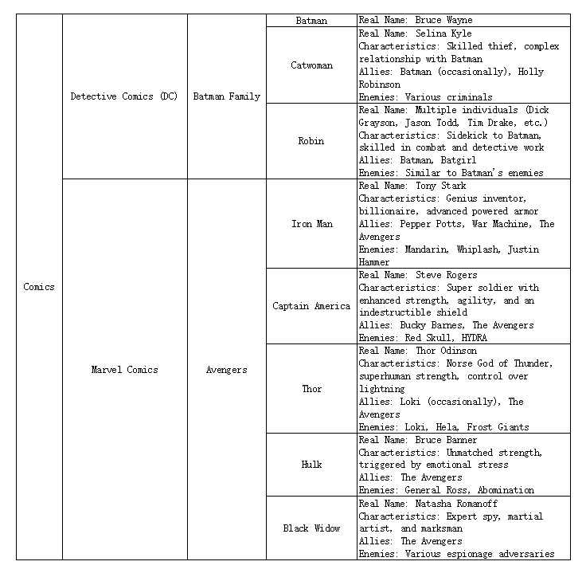

# md2xlsx

<div align="center">


[](https://github.com/shangcode/md2xlsx/actions/workflows/pylint.yml)

</div>

---

## Description

Convert structed markdown content into sheet(XLSX).

## Is this for me?

If you want convert a markdown like this:

```md
# Comics

## Detective Comics (DC)

### Batman Family

#### Batman

...

#### Catwoman

...

## Marvel Comics

### Avengers

#### Iron Man

...

#### Captain America

...
```

into sheet like this:
|h1|h2|h3|h4|h5|
|--|--|--|--|--|
|Comics|Detective Comics (DC)|BatmanFamily|Batman|...|
|Comics|Detective Comics (DC)|BatmanFamily|Cat woman|...|
|Comics|Marvel Comics|Avengers|Iron Man|...|
|Comics|Marvel Comics|Avengers|Captain America|...|

then you are on the right place.

💡Futhuremore, you can use office tools to modifiy the sheet according to your preferences:


## Usage

```console
md2xlsx [OPTIONS] IN_FILE OUT_FILE
```

**Options**:

- `--install-completion`: Install completion for the current shell.
- `--show-completion`: Show completion for the current shell, to copy it or customize the installation.
- `--help`: Show this message and exit.

**Arguments**:

- `IN_FILE`: Enter the markdown filepath [required]
- `OUT_FILE`: Enter the xlsx filepath [required]

## License

This project is licensed under the terms of the MIT license.
